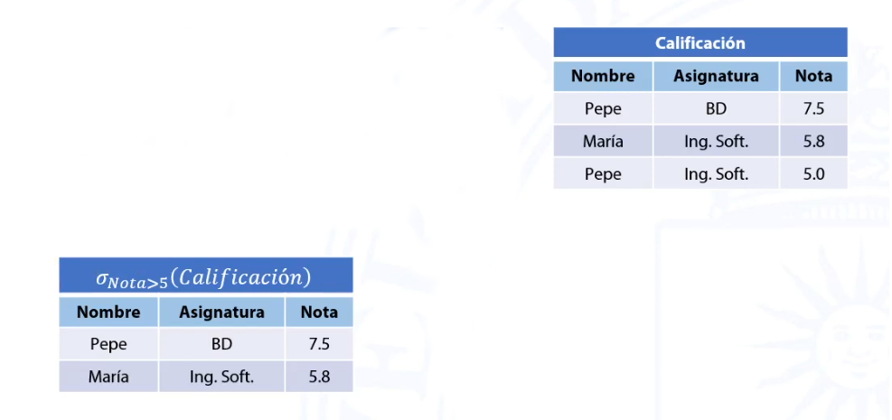

# Algebra relacional - operadores basicos
El Algebra relacional es un lenguaje de consulta procedural. Consta de un conjunto de operaciones que toman como entrada una o dos relaciones y producen como resultado una nueva relación, por lo tanto, es posible anidar y combinar operadores.

## Proyeccion &pi;
- La proyeccion de una relacion (R) es la relacion definida sobre los atributos indicados (A,B, ...): &pi; A,B,..(R)
- Eliminas posibles filas duplicadas 

## Selección &sigma;
- La seleccción (&sigma;) definida sobre una relación R, según un criterio lógico f, es el conjunto de tuplas que verifican el criterio f: &sigma;f(R).

## Unión &cup;
- Es igual la que la operacion de unión en la teoria de conjuntos.
- Restricción para la unión de dos relaciones: ambas deben tener el mismo conjunto de atributos.

## Diferencia &#8212;

- Es igual que la diferencia en la teoría de conjuntos.
    - _R_ &#8212; _S_ contedrá todas las tuplas de R que no estan en S.
- **Restricción para la diferencia de dos relaciones:** ambas deben tener el mismo conjunto de atributos

## Producto cartesiano &#120;

-  Es igual uqe el producto cartesiano en la teoria de conjuntos
- El producto cartesiano de dos relaciones R y S, _R_ X _S_, es otra relación cuyaa tuplas se forman concatenando cada tupla de R con cada una de las de  S en todas las formas posibles.

