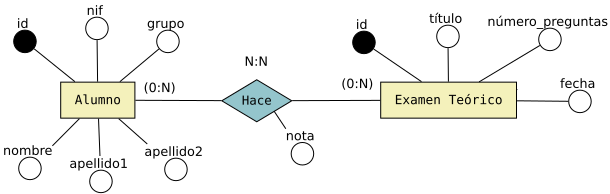

# DEL MODELO ENTIDAD RELACIÓN AL MODELO RELACIONAL(TABLAS)

## 1. Entidades fuertes y débiles
Cada una de las entidades (fuertes y débiles) del diagrama E/R genera una tabla, donde cada uno de los atributos de la entidad pasa a ser una columna de la tabla.<br><br>
**Ejemplo:**


En este ejemplo las entidades fuertes Alumno y Examen Teórico generan una tabla en el modelo relacional con las siguientes columnas.

* ALUMNO(<u>id</u>, nombre, apellido1, apellido2, nif, grupo)
* EXAMEN_TEÓRICO(id, título, número_preguntas, fecha)

|id|nombre|
|--------|--------|
|    A    |    B    |
|    C    |    D    |


```sql
 SELECT -- extracts data from a database.
 UPDATE -- updates data in a database 
 DELETE -- deletes data from a database
INSERT INTO -- inserts new data into a database
CREATE DATABASE -- creates a new database
ALTER DATABASE -- modifies a database
CREATE TABLE -- creates a new table 
ALTER TABLE -- modifies a table
DROP TABLE -- deletes a table 
CREATE INDEX -- creates an index (search key) 
DROP INDEX -- deletes an index 
```


